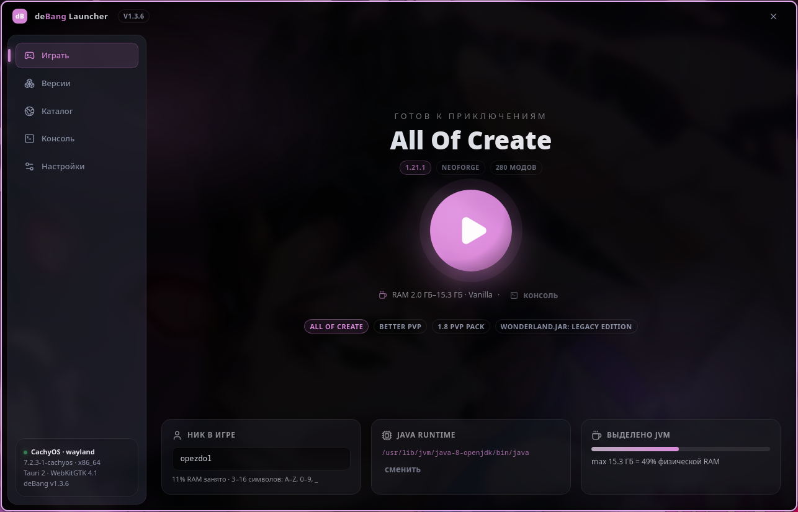
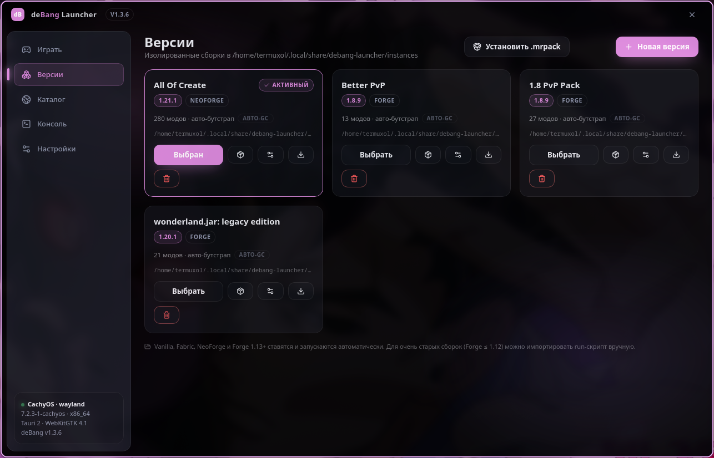
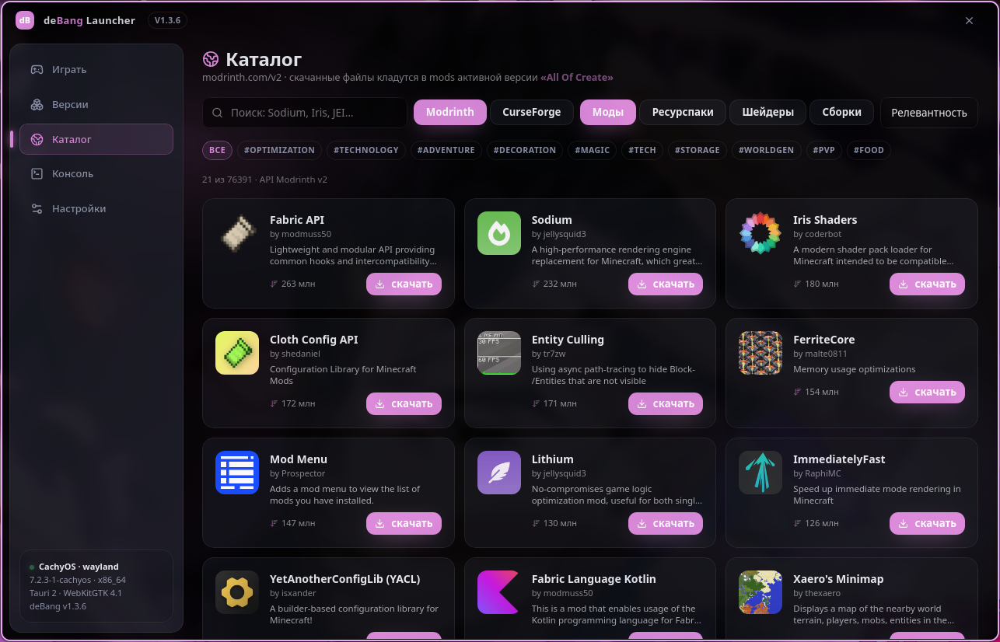
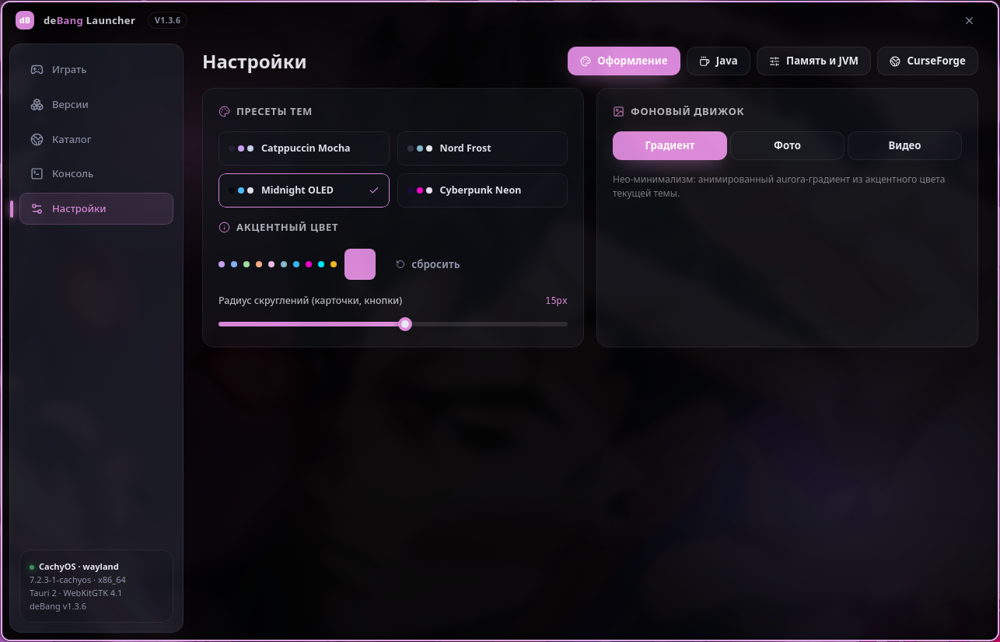

# deBang Launcher

Ultra-styled, deeply customizable Minecraft launcher for Linux, Windows and macOS.
Tauri v2 (Rust) + React/TypeScript + Tailwind.

## Сайт проекта

Лендинг лежит в [`website/`](website/) — статический проект на Tailwind 4
без рантайм-зависимостей, публикуется на GitHub Pages вкладкой **Actions →
Pages**. Локально: `cd website && npm run dev`.

## Возможности

- **Настоящий запуск**: скачивает клиент, библиотеки и ассеты Mojang, собирает
  classpath и запускает Vanilla / Fabric / NeoForge / Forge 1.13+ — установщики
  NeoForge и Forge запускаются автоматически, вручную ничего докачивать не нужно.
- **Инстансы**: изолированные профили с mods / resourcepacks / shaderpacks /
  saves; импорт `run.sh` / `run.bat` / `minecraft.jar` — только как запасной вариант.
- **Сборки Modrinth**: установка `.mrpack` с **выбором версии сборки**.
- **Каталог Modrinth**: моды, ресурспаки, шейдеры с учётом загрузчика и версии
  активного инстанса.
- **Консоль**: живой stdout/stderr игры в приложении, фильтры по потокам.
- **Оформление**: темы (Catppuccin / Nord / OLED / Cyberpunk), акцент, радиус,
  размытие/затемнение фонового изображения или видео.
- **Ник в игре** настраивается в Настройках (по умолчанию `deBangPlayer`).
- **Умный подбор GC и памяти** (в настройках профиля): Generational ZGC для
  Java 21+ и MC 1.20.5+, G1GC + `ParallelRefProcEnabled` для legacy-версий,
  авто-`Xms`/`Xmx` (3 ГБ до 1.12.2, 6 ГБ для 1.12.2–1.19, 8 ГБ для 1.20+,
  но не больше 70% ОЗУ).
- **Прокси на инстанс**: SOCKS5 или HTTP(S) — хост, порт, логин и пароль
  передаются в JVM как `-DsocksProxy*` / `-Dhttp.proxy*` / `-Dhttps.proxy*`.
  Пароль не выводится в консоль лаунчера.
- Пул загрузок ассетов, отмена загрузок, прогресс-бары подготовки.

## Требования

| Платформа | Что нужно |
|---|---|
| Linux | WebKitGTK 4.1, `webkit2gtk-4.1` (для Flatpak — само приложение) |
| Windows | [WebView2 Runtime](https://developer.microsoft.com/microsoft-edge/webview2/) (уже есть в Windows 11 и в свежих Windows 10) |
| macOS | WebKit (в системе) |

Java для Minecraft ставится отдельно: Java 8/17 для старых версий, Java 21 для
1.20.5–1.21.x, Java 25+ для новых. Лаунчер умеет находить установленные JDK
сам; на Windows дополнительно ищет JDK в `Program Files\Java`,
`Eclipse Adoptium`, `Microsoft`, `Zulu`, `BellSoft` и в `JAVA_HOME`.

## Установка

### Flatpak

```bash
flatpak install flathub io.github.deFallBang.deBangLauncher
```

### Arch (AUR)

```bash
yay -S debang-launcher
```

### Windows / Linux — готовые сборки

Скачать с [GitHub Releases](https://github.com/deFallBang/deBang-launcher/releases):
`.msi`/`.exe` для Windows, `.AppImage` и `.deb` для Linux.

### Из исходников

```bash
npm install
npm run tauri build          # соберёт текущую платформу
npm run tauri dev            # режим разработки
```

Требуются Rust (stable) и Node.js 20+.

## Где лежат данные

| Платформа | Путь |
|---|---|
| Linux | `~/.local/share/debang-launcher` |
| Windows | `%LOCALAPPDATA%\deBangLauncher` |
| macOS | `~/Library/Application Support/deBangLauncher` |

При первом запуске данные из старого `cachy-mc-launcher` переносятся
автоматически.

## Скриншоты



<table>
  <tr>
    <td width="50%"></td>
    <td width="50%"></td>
  </tr>
  <tr>
    <td align="center"><b>Версии</b><br>изолированные профили, менеджер модов, импорт сборок</td>
    <td align="center"><b>Каталог</b><br>Modrinth и CurseForge: моды, ресурспаки, шейдеры, сборки</td>
  </tr>
  <tr>
    <td></td>
    <td align="center" valign="middle">
      <b>Настройки</b><br>темы, акцентный цвет, фон<br><br>
      <sub>Все экраны — нативный Tauri 2 + React,<br>без браузерных вкладок и рекламы.</sub>
    </td>
  </tr>
</table>

## Лицензия

MIT — см. [LICENSE](LICENSE). Minecraft является товарным знаком Mojang Studios;
этот проект не связан с Mojang и не распространяет её ресурсы.
